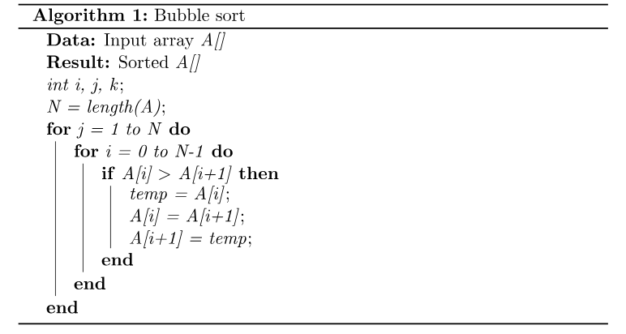

# Portafolio_C

Algorithms and examples to improve your logic in the C programming lenguage.

## Bubble Sort Algorithm

Bubble sort is a simple sorting algorithm that repeatedly steps through the list, compares adjacent elements, and swaps them if they are in the wrong order. The pass through the list is repeated until no swaps are needed, which indicates that the list is sorted. Here's how bubble sort works in programming:

1.- Start by comparing the first two elements of the list (or array).

2.- If the first element is greater than the second element, swap them.

3.- Move to the next pair of elements (i.e., the second and third elements) and compare them. Again, if the second element is greater than the third element, swap them.

4.- Continue this process, moving one pair of elements at a time and comparing them. After each pass through the list, the largest unsorted element "bubbles up" to the end of the list.

5.- Repeat steps 1-4 until you go through the entire list without making any swaps during a pass. This means the list is now sorted.

